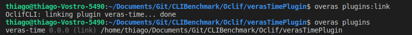
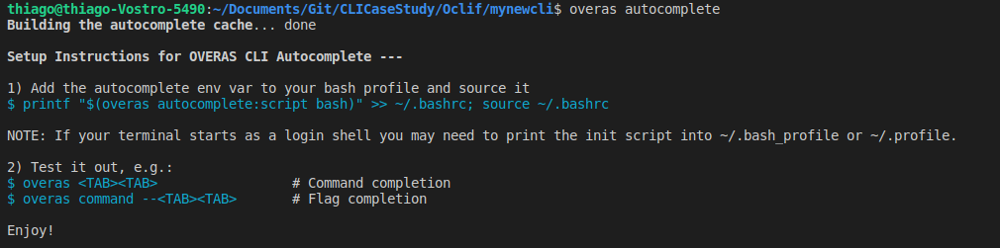
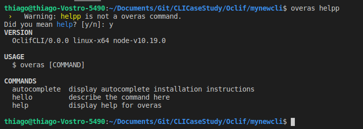
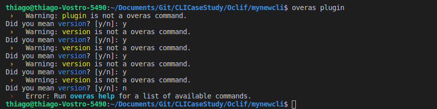
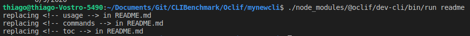

### [OCLIF](https://oclif.io)

[Medium Post](https://medium.com/adobetech/how-to-easily-create-clis-using-oclif-and-how-we-did-it-for-the-adobe-i-o-cli-e9eb888e9ec6)

## First impressions

- [Documentation](https://oclif.io/docs) very clear
- Hello World easy to reproduce
- Very clear to add `Plugins`

## [Features](https://oclif.io/docs/features)

| Flag/Argument parsing  | Autocomplete       | Plugins                    |
| ---------------------- |-------------       | ---------------------------|
| Testing Helpers        | Auto-documentation | CLI Generator              |
| Hooks                  | TypeScript         |   Auto-updating Installers |
| Coming soon: man pages | Super Speed        |                            |


## [Plugins](https://oclif.io/docs/plugins)

### How to add a plugin

- `yarn add @oclif/plugin-name`
- Add the following to your package.json 
```
    "oclif": {
        "plugins": [
            "@oclif/plugin-help",
            "@oclif/plugin-name" <---- Here
        ]
    }
```

### How to create plugin

- `npx oclif plugin plugin-name`

- Now you can code like normal Oclif CLI

- [My plugin](https://github.com/VerasThiago/OclifTimePlugin)


### How to add your own plugin

- `yarn add @oclif/plugin-plugins`

- Add the following to your package.json 
```
    "oclif": {
        "plugins": [
            "@oclif/plugin-help",
            "@oclif/plugin-plugins"  <---- Here
        ]
    }
```
Now the user can run any of the commands below to manage plugins at runtime.

- Move to your plugin root folder and run the command: `overas plugins:link`



### How to publish plugins

- All that is needed to run `overas plugins:install` to install a plugin is for it to be published on [npmjs.com](https://npmjs.com).

- [Create an account](https://www.npmjs.com/signup) then log into it from your terminal using: `npm login`

- Use [np](https://github.com/sindresorhus/np) to make publishing to npm easier. You can release an update with: `npx np`


## Useful Plugins

### Autocomplete
Yarn add command: `yarn add @oclif/plugin-autocomplete`

Don't forget to add on `package.json`
<br>
<br>




### Not found command plugin
Yarn add command: `yarn add @oclif/plugin-not-found`

Don't forget to add on `package.json`

<br>
<br>



**PROBLEM**

When I tried the *command* `plugin`, he suggests another *command* that don't exist. Also, you get stuck because since this *command* don't exist he will suggest another one (that is himself).



## Extras

### How to update CLI or Plugin documentation

- Run: `./node_modules/@oclif/dev-cli/bin/run readme` in your root folder



- Checkout the README file generated [here](../mynewcli/README.md)